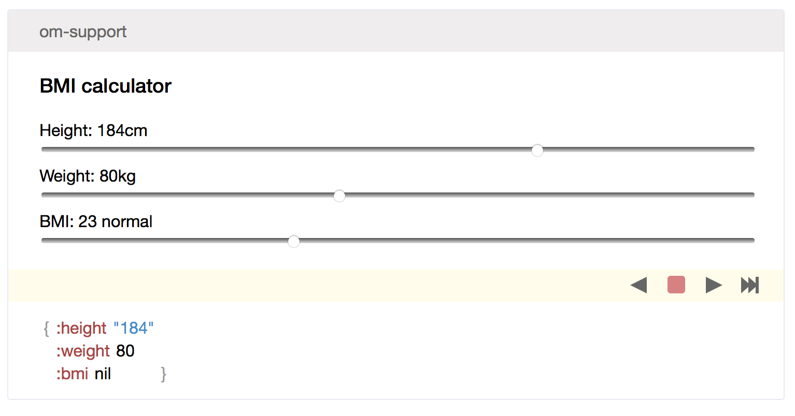

## Testing ##

Yeah, yeah.

I know we should be testing.

Note:

---
## Browser testing

Not going near it.

Note:
Lots of tools that work well.

---
## CI testing
Nope.

Note:
A lot to talk about, usually:
Run this command, get this output file.

---

## Autobuild testing
Test while you work.

* Edit
* Reload
* Test

Note:

It's a new way of developing, so a new way to test.

---

## Why?
|Language | Compile | Run |
|---|---:|---:|
|Clojure| JVM<!-- .element: class="jvm" --> | JVM <!-- .element: class="jvm" -->|
|Clojurescript| JVM <!-- .element: class="jvm" -->| JS <!-- .element: class="js" -->|

Note:
Everything was quite simple in Clojure-land.
In Clojurescript we need to think about the different target.
All of the test commands will run in a JS setup.

---

## Tools
Some tools you might use:

||Plugin|Lib|
|---|:---:|:---:|
|cljsbuild|✓||
|figwheel|✓||
|doo|✓|✓|
|devcards||✓|
|speclj||✓|

Note: some are essential, others are optional.

Some need special build settings or separate configs.

---
## Leiningen config

| |
|:---:|
|Plugins|
|Dependencies|
|Settings|
|Builds|
|Profiles|
| &c.|

Lots of configuration to pass into your build!

Note: Your project.clj might get terribly complicated. Especially when
using profiles &c.

Reminder this will all be in the repo ready to copy.

---
## Figwheel ##

[/bhauman/lein-figwheel](https://github.com/bhauman/lein-figwheel)

Use it.

```clojure
:plugins [[lein-figwheel "0.4.1"]]
:cljsbuild {:builds
            {:build-id
             {:figwheel {:on-jsload "my-code.runner/run-this"}
              :compiler {;; this usually helps for figwheel
                         :optimizations :none}}}}
;; live-reload CSS
:figwheel {:css-dirs ["resources/public/"]}
```

Note:

Defonce ALL THE THINGS.

You really need a big reason not to use figwheel when developing.

You would need to output something (or check your console).

(Maybe change your icon?)

It seemed like some cruft hangs around affecting tests, lein clean or nuke your
compiled resources.

---
## Figwheel in Action ##

```clojure
(ns ^:figwheel-always my-code.runner
 (:require [cljs.test :refer-macros [run-all-tests]]
           [my-code.models-test]))

(enable-console-print!)

(defn ^:export run-this []
  (run-all-tests #".*-test$"))

```

Note:

So each time the code runs you should get browser console output for tests.
Regex means you probably won't forget the test.
NS metadata is needed -always -load

---

## Doo ##

[/bensu/doo](https://github.com/bensu/doo)

Shortcuts a lot of the messy configuration

I just want to run some tests!

```clojure
:plugins [[lein-doo "0.1.6-SNAPSHOT"]]
:doo {:build "build-id"}
:build-id {:main "code.testrunner"}
```

Note: When you just want run your tests without needing extra resources.

You need the plugin to run.

Autotest or once for your tests.

It packages all of the extra JS needed to call the JS commands

---

## Doo in Action ##
```clojure
(ns code.testrunner
  (:require [cljs.test :as test]
            [doo.runner :refer-macros [doo-all-tests doo-tests]]
            [ex.project-ns-test]))

(doo-all-tests nses)
```

```shell
lein doo phantom
```

Note:
You need to declare your tests.

It's easy to forget to add them in.

---

## Devcards ##

[/bhauman/devcards](https://github.com/bhauman/devcards)

```clojure
:dependencies [[devcards "0.2.0-8"]]
:figwheel {:devcards true}
```
* Brilliant interaction
* Isolate components
* Report style tests

Make a different HTML page to launch the devcards.

Note:

It works reagent, Om &c. Can work with re-frame but due to the global nature of
re-frame it works against you.

It's great for tweaking CSS and layout logic: you can have a component with data
pre-populated.

In a way, it feels like IPython: great for experimenting and quick tweaking.

You will need a separate build ID.

---

## Devcards in Action ##


---
## Speclj ##

[/slagyr/speclj](https://github.com/slagyr/speclj)

A terse syntax for tests that helps with BDD

It has options to build in your test runners without needing too much extra ceremony.

```clojure
:dependencies [[speclj "3.3.0"]]
:plugins [[speclj "3.3.0"]]
:cljsbuild {"build1" {...
  :notify-command ["phantomjs" "bin/speclj" "resources/public/js/compiled/example_project.js"]
}}
```
Note:
Lots of mocks & stubs.

You need the plugin & lib

It has support for test selectors.

---
## Speclj in Action ##

```clojure
(ns sample.core-spec
  (:require-macros [speclj.core :refer [describe it should run-specs]])
  (:require [speclj.core]))

(describe "Mathematics"
          (it "works"
              (should (even? 2))))
(run-specs)
```

---
## Test resources
```clojure
(clojure.java.io/resource "super-test-data.json")
```

Can't run that in Clojurescript!

```clojure
(defmacro slurp-data [res]
  (let [data (slurp (io/resource ~res))]
    `~data))
```
```clojure
  (:require-macros [... :refer [slurp-data]])
...
(def super (slurp-data "super-test-data.json"))
```

Note:

Using test data fixtures in Clojure is simple to do meaningful tests.

It just requires a small bit of planning to load your resources.

Or load in HTML page?

---
## Reporting & output ##
You can get console output for most of these libraries.

Note:
I haven't seen any fully-functioning report generation.

---

## Wrapping up ##
[/davidjameshumphreys/testing-times-in-clojurescript/](https://www.github.com/davidjameshumphreys/testing-times-in-clojurescript/)
Note: The code will be online. If anyone has some better recipes for
testing in Clojurescript, or just want to discuss more I'd be
interested to hear about it.
